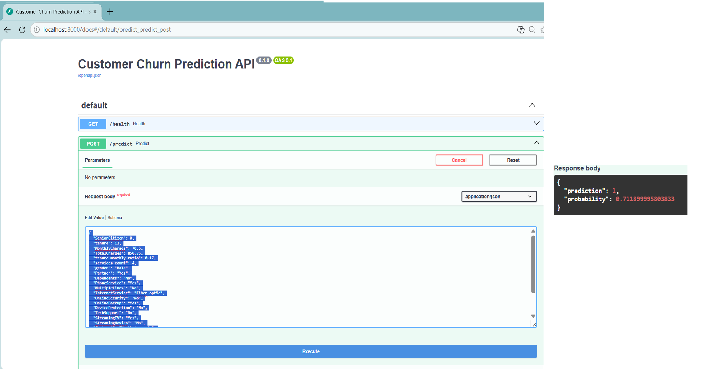
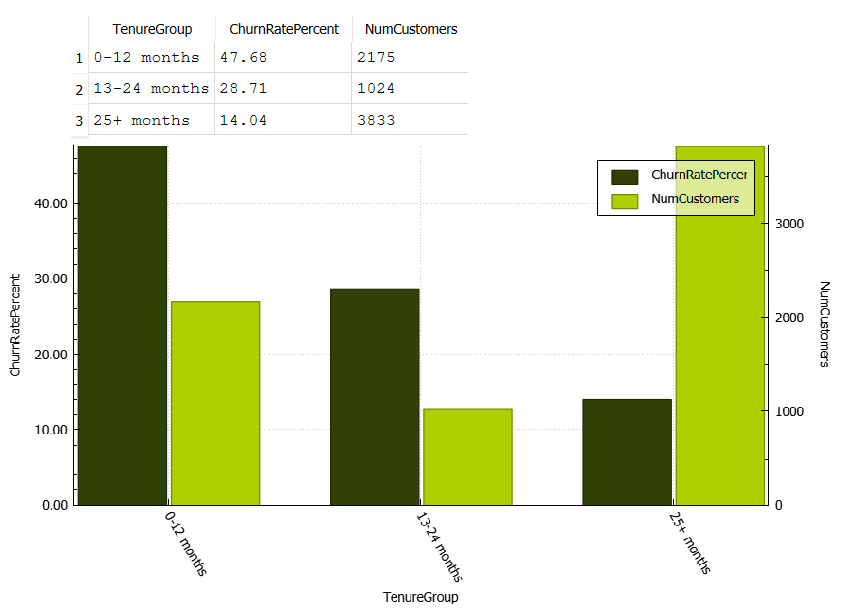
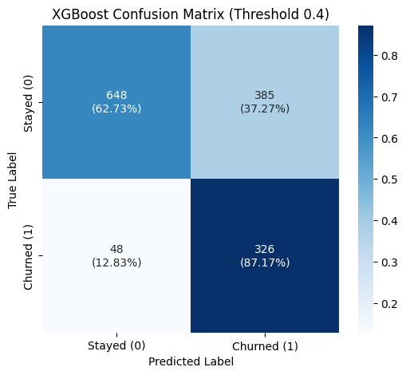

# Customer Churn Prediction
### End-to-End **Data Science** & **Machine Learning** Solution

---

### 📑 Quick Navigation
[Business Impact](#business-impact--problem-statement) • [Demo Showcase](#-demo-showcase) • [Tech Stack](#tech-stack) • [Engineering](#engineering--production-standards) • [Performance](#model-performance) • [Insights](#key-features-and-insights) • [Project Structure](#-click-to-view-project-structure) • [Documentation](#documentation) • [Author](#-author)

---

## Business Impact & Problem Statement
Customer churn is a critical challenge in telecom/SaaS. This project provides an automated system to **predict, explain, and prevent** customer loss.

* **~19.5%** customers flagged as **high-risk** 
* Month-to-month contracts: ~ **60%** churn vs **~13%** for long-term contracts
* Estimated revenue impact: ~**€2M/year saved** with 5% churn reduction
* Top **20%** high-risk customers → ~**50%** of churn
* Enables **targeted retention strategies & ROI optimization**

---

## 📸 Demo Showcase
##### click below

<details>
<summary>📽️ <b>Power BI Dashboard Demo</b></summary>
<br>
<video src="https://github.com/user-attachments/assets/d9a76e0e-2468-49cf-b0ba-103bd1cca69d" controls width="600"></video>
</details>

<details>
<summary>📽️ <b>Streamlit App Demo</b></summary>
<br>
<video src="https://github.com/user-attachments/assets/3cc4bae8-3b09-4601-b25d-1a591ce72fb4" controls width="600"></video>
</details>

<details>
<summary>🖼️ <b>FastAPI & SQL Analysis</b></summary>
<br>
<h4>FastAPI API</h4>

<h4>SQL Analysis - Tenure Groups</h4>

</details>

---

## Tech Stack

* **Language:** Python (Pandas, NumPy, Scikit-learn)
* **Modeling:** XGBoost, SHAP (Explainability)
* **API & UI:** FastAPI, Streamlit
* **Analytics & Data:** Power BI, SQL
* **DevOps/Engineering:** Joblib, Modular Package Design
  
---

## Engineering & Production Standards

| Focus | Implementation | Key Value |
| :--- | :--- | :--- |
| **Architecture** | Modular `src/` package (`pip install -e .`) | No `sys.path` hacks; clean, relative imports. |
| **Separation** | Isolated EDA notebooks vs. Production `.py` | Scalable, maintainable & CI/CD-ready code. |
| **Pipeline** | End-to-End Automated ML Workflow | Robust data cleaning & XGBoost training. |
| **Deployment** | FastAPI (Backend) + Streamlit (UI) | Production-ready web accessibility. |
| **Portability** | ASCII-only code & `pyproject.toml` | Cross-platform & environment compatibility. |

---

## Model Performance
#### Confusion Matrix – XGBoost Model (threshold = 0.4)


* Model: **XGBoost (tuned)**
* Recall: **0.87** (optimized to catch churners)
* Threshold: **0.4** (business-driven tuning)
* Minimize missed churners (false negatives)

---

## Key Features and Insights

* **Tenure / Monthly Charges ratio**
* **Contract Type impact**
* **Fiber Internet usage**
* **Service usage intensity**

These features explain **~55% of churn behavior**.

---

## Project Structure
<details>
<summary><b>📂 Click to view Project Structure</b></summary>
    
```text
customer-churn-end2end/
├── data/ # Raw and processed datasets
├── notebooks/
│   ├── 01_EDA.ipynb # Exploratory Data Analysis
│   ├── 02_Feature_engineering.ipynb # Domain-driven feature creation
│   ├── 03_Preprocessing.ipynb # Data cleaning & preprocessing
│   ├── 04_Model_Training.ipynb # Model Training, Tuning & Evaluation
│   ├── 05_Explainability.ipynb # Explainability & Business Storytelling
│   ├── 06_Scoring_and_Export # Offline scoring and export to SQL
├── src/
│   ├── __init__.py # package initialization
│   ├── preprocessing.py # data cleaning and preprocessing functions
│   ├── feature_engineering.py # create derived or domain-specific features
│   ├── evaluation.py # model evaluation metrics and helper functions
│   ├── modeling.py # model training, fitting, and prediction logic
│   ├── explainability # SHAP-based explainability functions & visualizations
├── models/ # Trained model artifacts (joblib) and Perforance Demo
├── app/
│   ├── api.py # Fast API
│   ├── streamlit_app.py # Interactive UI Streamlit App
│   ├── Customer_Churn_Prediction_App_Guide.pdf # PDF with step-by-step setup and usage instructions
├── docs/ # Power BI, SQL, FastAPI and StreamlitApp documentation
│   ├── Demos/ 
│   ├── PowerBI/ 
│   ├── SQL/ 
├── pyproject.toml # package metadata
├── README.md  # project overview
├── requirements.txt # list of Python dependencies
├── run_my_apps.ps1 # script to run FastAPI and Streamlit apps
├── tests/ # Check API and ML pipeline functionality
```
</details>

---

## Documentation

A detailed setup and usage guide is available:

👉 **[Customer_Churn_Prediction_App_Guide.pdf](app/Customer_Churn_Prediction_App_Guide.pdf)**

Includes:
- Environment setup
- Running FastAPI & Streamlit
- App usage & inputs
- Troubleshooting

---

## 👤 Author

**Rizos Constantinos**  
- LinkedIn: www.linkedin.com/in/constantinos-rizos-0589b5254  
- GitHub: https://github.com/RizosConstantinos
  
---

## ⭐ If you found this useful, feel free to star the repo!

